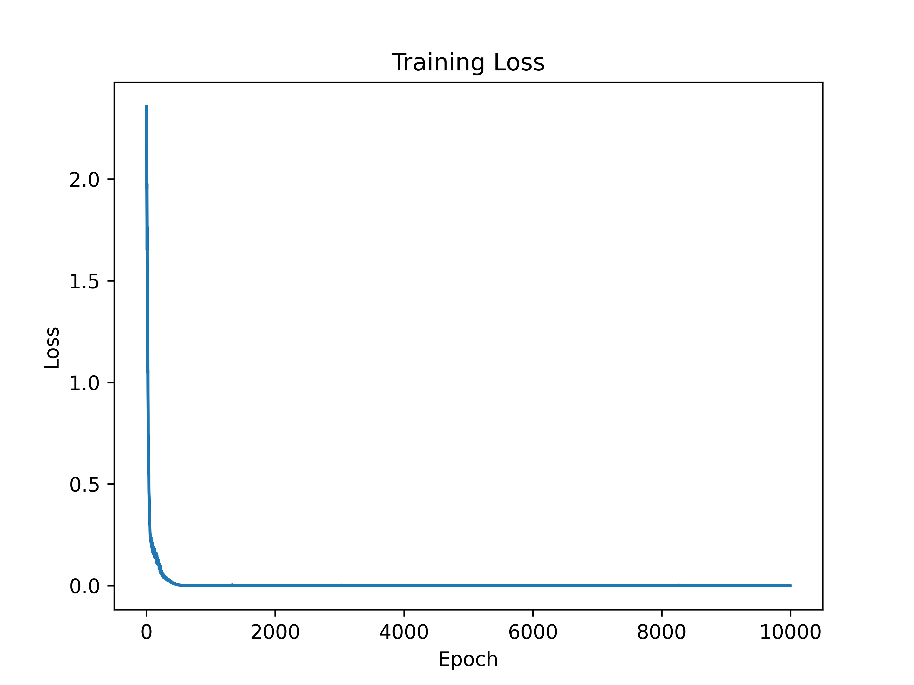
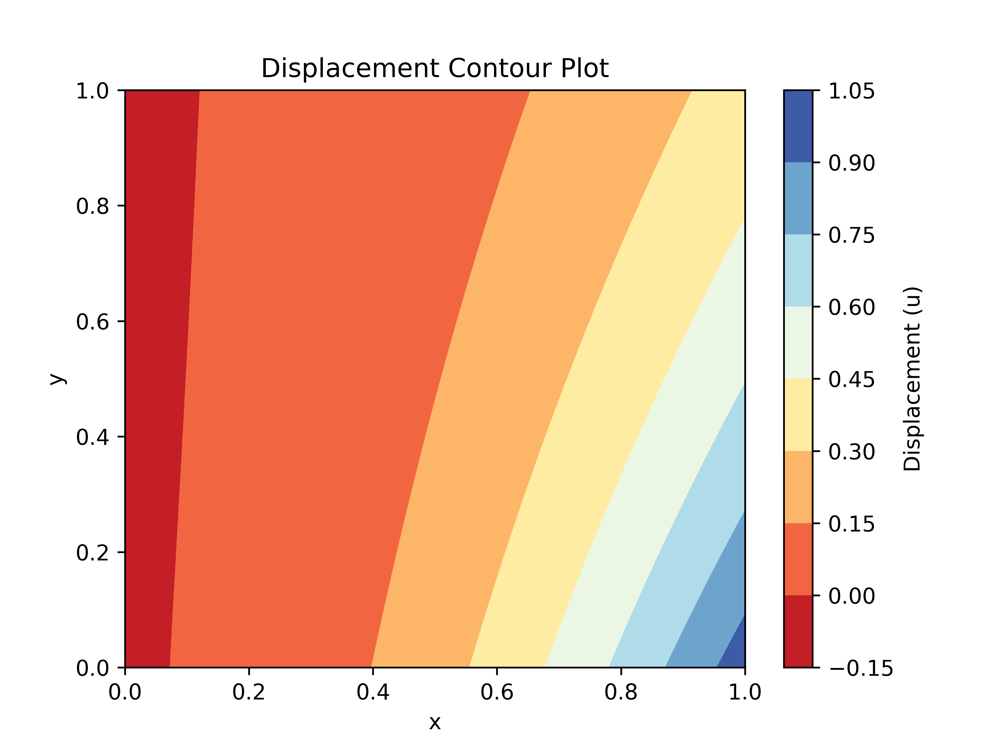
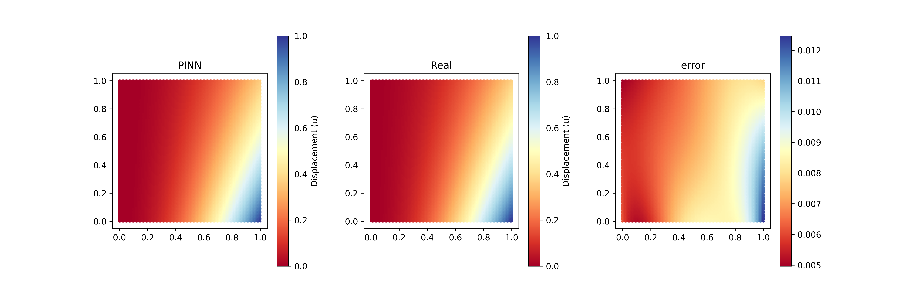

# Simple PINN cases
Mainly introduces a **simple PINN case**, but also in my learning PINN contact with the first model, I would like to share for everyone to learn.  

The case can be changed to suit your needs. Time t is not currently considered and further updates will follow, hopefully.
 
- **PDE:** $\frac{\partial^2 u}{\partial x^2}- \frac{\partial^4 u}{\partial y^4}=\left ( 2-x^2 \right ) e^{-y} $
- **BC:**  $u_{yy} \left ( x, 0 \right ) = x^2$  
&nbsp;&nbsp;&nbsp;&nbsp;&nbsp;&nbsp; $u_{yy} \left ( x, 1 \right ) = \frac{x^2}{e} $  
&nbsp;&nbsp;&nbsp;&nbsp;&nbsp;&nbsp; $u \left ( x, 0 \right ) = x^2$    
&nbsp;&nbsp;&nbsp;&nbsp;&nbsp;&nbsp; $u \left ( x, 1 \right ) = \frac{x^2}{e} $  
&nbsp;&nbsp;&nbsp;&nbsp;&nbsp;&nbsp; $u \left ( 0, y \right ) = 0 $  
&nbsp;&nbsp;&nbsp;&nbsp;&nbsp;&nbsp; $u \left ( 1, y \right ) = e^{-y} $     

